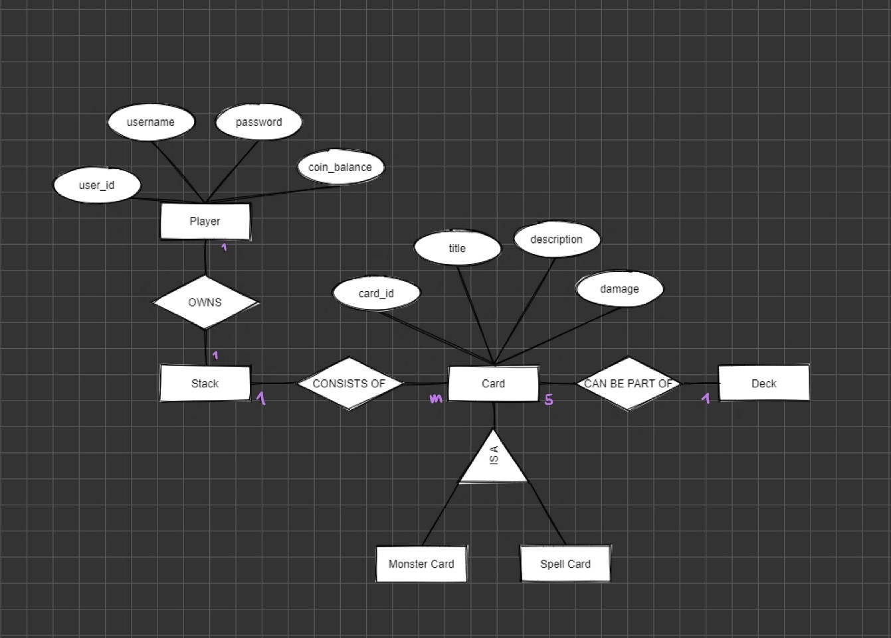

# MCTG

Semesterprojekt, SWEN 1
Ines Mayer

## Setup

### Postgres DB als Docker Container

docker run --name mctg_postgres -e POSTGRES_PASSWORD=swen1 -d -p 5432:5432 postgres

Create-Script ausführen (siehe Git-Repository) oder Tabellen manuell anlegen siehe Abbildung Tabellenschema.

## Application Design

Meine Applikation ist logisch in 3 Layer unterteilt:

- **Presentation Layer (PL)**: Schnittstelle nach außen, Http-Server, Controller
- **Business Layer (BL)**: Logik in Form von Services; Models
- **Data Access Layer (DAL)**: Repositories inkl. jeweiligen Interface, PostgresAccess-Klasse zur Verwaltung der DB-Connection

Weiteres beinhaltet meine Projektstruktur folgende Ordner:

- Utility/Json: Zum Parsen von Json benötigte Models
- Exceptions: Custom Exceptions

### Datenbank

Beim Erstellen der Datenbank habe ich mein Wissen aus der LV "Datenmanagement" angewendet und mir zu Beginn zur besseren Visualisierung ein ERM für den konkreten Sachverhalt erstellt. Dies half mir dabei eine sinnvolle Tabellenstruktur zu entwickeln.  
Nachfolgende Abbildungen zeigen mein ERM, sowie die schlussendlich tatsächlich erstellten Tabellen.

Zugriff auf die Datenbank erfolgt via Repositories. Zu jedem Repository gibt es ein zugehöriges Interface.

Durch Prepared Statements verhindere ich SQL Injections. Zudem arbeite ich teilweise mit Transactions um zu garantieren, dass gewisse Operationen, wie etwa das Kaufen eine Packages als Ganzes ausgeführt werden oder garnicht (e.g. User soll keine Coins verlieren ohne die jeweiligen Packages zu bekommen)

Weiteres habe ich darauf geachtet, dass zu jedem Zeitpunkt nur eine einzige Verbindung zur Datenbank existiert. Verwaltung der Connection übernimmt die PostgresAccess-Klasse. PostgresAccess implementiert das Singelton-Pattern mit Lazy initialization.  

### HttpServer & Routing

Für den Http-Server habe ich das Beispiel aus der Vorlesung abgeändert. Die grundlegende Logik zum Anhandeln der Clients wurde beibehalten. Den Http-Parser habe ich erweitert, sodass auch der Content von Post-Requests geparsed5 wird. Zudem habe ich Klassen für Http-Request und Http-Reponse erstellt, um diese effektiver zu Handhaben.

Für das Routing habe ich eine Router Klasse erstellt. Diese enthält Dictionaries mit einem String (Route) als Key und einem delegate als Value (Methode der Controller-Klassen), für jede Http-Anfragemethode e.g. PostRoutes, GetRoutes. Dadurch kann ich auf die gleiche Route mehrere Endpoints legen.

Zur besseren Übersicht hab ich meine Endpoints in Controller-Klassen thematisch gruppiert.

### Register, Login, Token

- User können sich registrieren und Einloggen
- Simple Validierung der Userdaten.
- Username muss unique sein

### Game Logic

Statt einer Route /battle gibt es in meiner Version 2 Routen:

/battle/new -> Erstellt eine neue BattleRequst, Battle wird gestartet, sobald ein weiterer Spieler mit /battle/join die BattleRequest annimmt
/battle/join -> Suche für eine Minute nach offenen BattleRequests (Polling)

#### /battle/new
GameService erstellt eine neue BattleRequest, die in einer globalen ConcurrentQueue gespeichert wird. Bis ein Spieler gefunden wird, muss der User warten (active Polling, warten bis Event OnAccept ausgelöst wird). Wird die BattleRequest angenommen wird das Battle gestartet. Beide Partein warten mit active Polling auf das Event OnGameEnd, mit dem der Winner, sowie weitere Daten zum Spiel übermittelt werden. Die jeweiligen Spieler bekommen als Reponse diese Daten übermittelt.

#### /battle/join
User sucht nach aktiven BattleRequest für 1 Minute, wird keine Battle-Request gefunden wird eine Fehlermeldung gesendet. Wird eine BattleRequest angenommen wird das Event OnAccept ausgelöst.

Die eigentliche Spiellogik ist Teil der Battle-Klasse. Implementierung nach Spezifikationen der Angabe.

### Stats und Scoreboard

- Verwaltung des Scoreboards als eigene Tabelle in der Datenbank
- /stats zum Anzeigen der Stats für einen bestimmten User
- /score zum Anzeigen des geamten Scoreboards, sortiert nach Elo

### User Profile

Nicht implementiert

### Trading

Nicht implementiert

### Special Feature: Multiple Decks

Als Special Feature habe ich das Erstellen und Verwalten von Karten-Decks insofern erweitert, dass User mehrere Decks parallel erstellen können und dann je nach belieben das aktive Deck (mit dem gespielt wird) zu ändern. Karten können dabei Teil meherer Decks sein, da immer nur mit einem gespielt wird.

- Erstellen eines neuen Decks via /deck/add (POST)
- Alle Decks eines Users auflisten /deck/all (GET)
- Aktives Deck setzen /deck (PUT)
- Aktives Deck anzeigen /deck (GET)

### Weitere Erweiterungen

- Passwort als Hashwert in der DB
- Karten Beschreibungen
- Error 404, wenn Route nicht existiert

## Änderungen im Curl-Script (Datei im Git-Repository)

- Json zum Erstellen der Karten abgeändert
- /login statt /sessions
- /register statt /users
- neue Routen zum Starten bzw. Joinen eines Battles
- neue Routen zum Erstellen, sowie Wechseln eines Decks

## Unit Testing Decisions

Unit-Testing mit NUnit.

Fokus meiner Unittests liegt beim Testen der Game-Logik, da diese aufgrund verzweigter if-else-Statements sehr fehleranfällig ist und auch nur schwer manuell überprüft werden kann.

Zudem habe ich Teile meiner UserService und CardService Klasse getestet, da diese integraler Bestandteil des Programms sind. Dabei habe ich ein Custom Fake für das jeweils verwendete Repository manuell erstellt. Dieses habe ich mittels constructor injection injected.

## Lessons learned

- Unit Tests nebenbei machen (Stichwort TDD) und nicht erst am Ende des Projekts: Unit-Tests am Ende machen ist sehr zeitaufwendig, insebesondere wenn sich der Code nicht gut testen lässt (aufgrund e.g vieler Dependencies, private Methoden, ...). Da dieses Projekt mein erstes Projekt mit C# ist, habe ich mich mehr auf die Umsetzung fokusiert, und die Tests zum Schluss aufgehoben.
- Arbeiten mit Git verbesserungswürdig: Da ich bisher noch nie wirklich produktiv mit Git gearbeitet habe, war der Workflow sehr ungewohnt für mich. Ich habe öfter auf das Commiten Vergessen.  
- Durchs selbst Programmieren lernt man am besten: Deutliche Verbesserung meiner C# Kenntnisse da ich zum ersten Mal in diesem Semester die Zeit gefunden habe mich wiklich aktiv mit C# zu beschäftigen.

## Tracked Time

Keine Aufzeichnung

## Link zu GitRepos

[Git Repository](https://github.com/xxaemy/MCTG)
