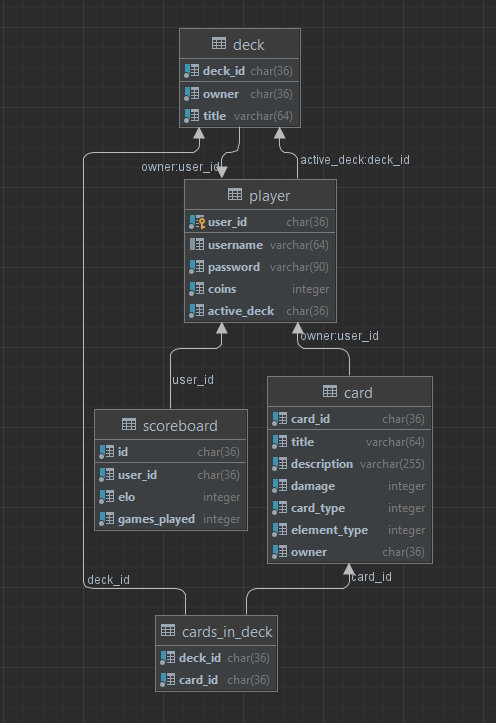

# MCTG

Semesterprojekt SWEN 1
Ines Mayer

## Setup

## Postgres DB:

docker run --name mctg_postgres -e POSTGRES_PASSWORD=swen1 -d -p 5432:5432 postgres

### Create Skript:

Create Script DB mit Dummy-Daten

## Application Design

Meine Applikation is logisch in 3 Layer unterteilt: 

- Presentation Layer(PL): Enthät meinen HttpServer, sowie Controller, die die Delegates meiner Routen thematisch gruppieren
- Business Layer(BL):  Enthält meine Models (e.g. Card, User) sowie diverse "Services"(e.g GameService, UserService) die von den Controllern aufgerufen werden, Services interagieren mit den Repositories, verarbeiten die daraus gewonnenen Daten   
- Data Access Layer(DAL): Reposiorys übernehmen Interaktion mit der Datenbank, PostgresAccess-Klasse dient zur Verwaltung der DB-Connnection

Weiteres beinhaltet meine Projektstruktur folgende Ordner:
 - Utility/Json: Zum Parsen von Json benötigte Models
 - Exceptions: Custom Exceptions

### Database

Beim Erstellen der Datenbank habe ich mein Wissen aus der LV "Datenmanagement" angewendet und mir zu Beginn zu besseren Visualisierung ein ERM für den konkreten Sachverhalt erstellt.
Dies half mit dabei eine sinnvolle Tabellenstruktur zu entwickeln.  
Nachfolgende Abbildungen zeigen mein ERM, sowie die schlussendlich tatsächlich erstellten Tabellen.

Zugriff auf die Datenbank erfolgt via Repositories. Ich habe mich aktiv mit dem Repository Pattern beschäftigt. Allerdings blieb mir leider nicht genug. Daher eine etwas abgespeckte Version.  

Durch Prepared Statements verhindere ich SQL Injections. Zudem arbeite ich teilweise mit Transactions um zu garatnieren, dass gewisse Operationen, wie etwa das Kaufen eine Packages als Ganzes ausgeführt wird oder garnicht (e.g. User soll keine Coins verlieren ohne die jeweiligen Packages)

Zudem habe ich darauf geachtet, dass zu jedem Zeitpunkt nur eine einzige Verbindung zur Datenbank existiert. Um Race.
DAzu habe ich die Klasse "PostgresDBAccess" erstellt.

### HttpServer & Routing
Für den Http-Server habe ich das Beispiel aus der Vorlesung abgeändert. 
Http-Request,Zum Senden von Http-Response habe ich die Klasse .

## Game Logic
Statt einer Route /battle gibt es 2 Routen:

/battle/new -> Erstellt eine neue BattleRequst, Battle wird gestartet, sobald ein weiterer Spieler mit /battle/join die BattleRequest annimmt
/battle/join -> Suche für eine Minute nach offenen BattleRequests

Events & Pooling.

## Special Feature1: Multiple Decks

# Weitere Abänderungen vom Curl Skript:

- Json zum Erstellen der Karten abgeändert
- /login statt /sessions
- /register statt /users

## Unit Testing Decisions

Fokus meiner Unittests liegt beim Testen der Game-Logik, da diese aufgrund verzweigter if-else-Statements serh fehleranfällig ist und auch nur schwer manuell überprüft werden kann.

Weitere Unittests:
- TestCase1
- TestCase2
- TestCase3

## Lessons learned

- C# Kenntnisse deutlich verbessert: um ersten mal dieses Semster Zeit gehabt habe, auch die Gelegenheit mich an "Advanced Techqnuies" wie Delegates, Events 
- Unittests nebenbei machen anstatt am Ende des Projekts
- Zeitmanagement
- Besserer Einsatz von Git

## Time tracked
Keine Aufzeichnungen

## Link zu GitRepos:
https://github.com/xxaemy/MCTG